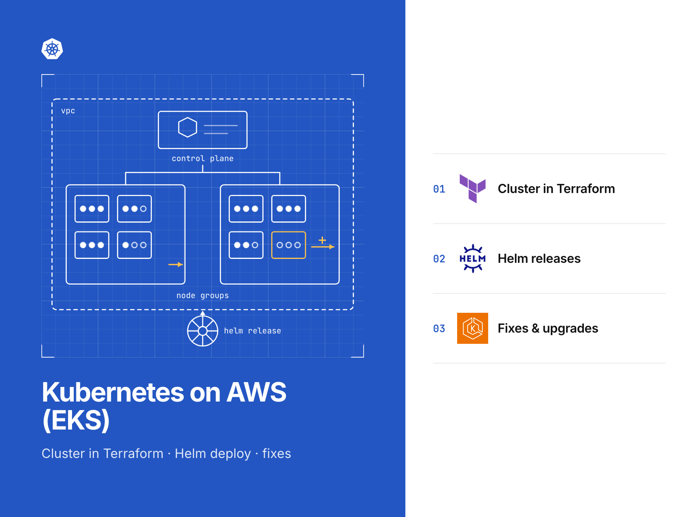
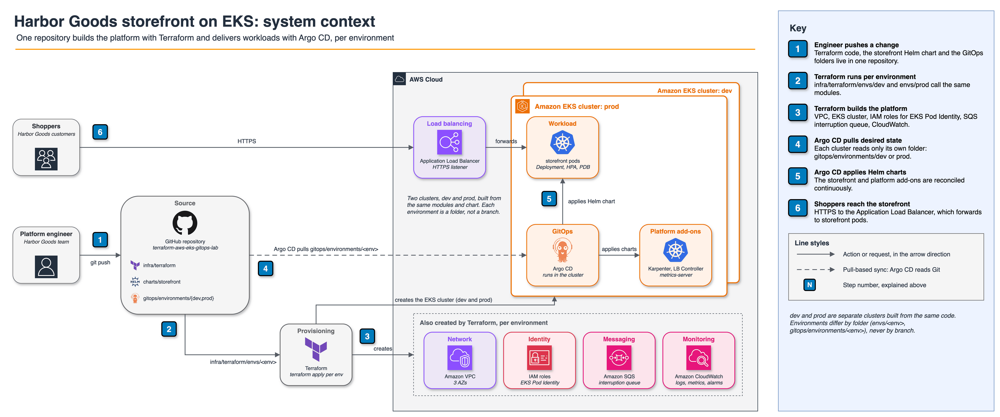

# Amazon EKS with Terraform, Helm and Argo CD

This repository runs an application on Amazon EKS using Terraform for infrastructure, Helm for packaging and Argo CD
for delivery, with a separate folder for each environment. Run `make verify` to check everything offline in one command.

[](https://github.com/gamaware/terraform-aws-eks-gitops-lab/actions/workflows/ci.yml)
[](LICENSE)




> **Lab.** Harbor Goods and all data here are fictional. Each repository in this portfolio is a
> separate engagement with Harbor Goods, a fictional mid-size retailer. Account IDs are AWS documentation examples.

## What this proves

- Small Terraform modules define the VPC, EKS, managed nodes, add-ons, Karpenter prerequisites and alarms.
  Mocked providers let all 37 `terraform test` runs check the cluster configuration without AWS or credentials.
- EKS Pod Identity binds one role to one service account for each controller, giving pods AWS access without keys
  or node roles. A hop limit of 1 and mandatory IMDSv2 on nodes prevent pods from using node credentials.
- A Helm chart packages the application, and its schema blocks unsafe configuration: `latest` tags, privileged
  ports, absent CPU or memory limits, an Ingress lacking TLS, or a PDB that would prevent node drains.
- Environment separation uses folders; it does not use branches. An Argo CD app-of-apps syncs
  `gitops/environments/dev` and `prod`. Sync waves put controllers in place before dependent resources, and tests
  catch mismatches between names in Terraform and the GitOps values.
- Within configured limits, the HPA adjusts pod counts and Karpenter adjusts node capacity. CloudWatch and SNS
  receive Container Insights, control plane logs and alarms.

## Inspect the deliverable

| Artifact | Where |
| --- | --- |
| EKS cluster, access entries, add-ons, Pod Identity | [`infra/terraform/modules/eks/`](infra/terraform/modules/eks/) |
| Karpenter IAM and interruption queue | [`infra/terraform/modules/karpenter/`](infra/terraform/modules/karpenter/) |
| Argo CD bootstrap (the only Kubernetes state in Terraform) | [`infra/terraform/modules/argocd-bootstrap/`](infra/terraform/modules/argocd-bootstrap/) |
| Environment roots | [`infra/terraform/envs/dev/`](infra/terraform/envs/dev/), [`prod/`](infra/terraform/envs/prod/) |
| Helm chart and its schema | [`charts/catalog-api/`](charts/catalog-api/), [`values.schema.json`](charts/catalog-api/values.schema.json) |
| App-of-apps per environment | [`gitops/environments/`](gitops/environments/) |
| Render assertions | [`tests/test_gitops.py`](tests/test_gitops.py), [`tests/test_chart.py`](tests/test_chart.py) |
| Live test with teardown | [`scripts/test-live.sh`](scripts/test-live.sh), [`docs/live-test.md`](docs/live-test.md) |

## Scenario and acceptance criteria

The fictional mid-size retailer Harbor Goods wants to run its catalog API on Kubernetes. It needs a dev cluster to
try changes and a prod cluster where every change goes through a reviewed pull request. Code must let the platform
team rebuild either cluster. Changes within the catalog team's folder must not let that team reduce cluster security.

The following conditions define a completed lab:

- `make verify` must pass without skipping scanner checks or suppressing lint findings.
- Both dev and prod must use the same modules, with differences confined to their environment roots and folders.
- Helm values and GitOps files must exclude account IDs, role ARNs and VPC IDs; the placeholder ACM certificate
  ARN on the Ingress is the sole exception.
- The catalog API must use a non-root process and a read-only root filesystem. In prod, it must scale from 3 to 12
  replicas, retain at least 2 during node drains and accept traffic exclusively over HTTPS.
- Access to the Kubernetes API must stay within the listed CIDR ranges, with an explicit list of cluster admins.

## Architecture



All changes start with a platform engineer working in one repository. For each environment, `terraform apply`
creates the VPC, EKS, node roles, Pod Identity roles, Karpenter interruption queue, logs and alarms on AWS. Terraform
then installs Argo CD and a single root Application. Argo CD takes over synchronization of all in-cluster resources
from `gitops/environments/<env>`, including the load balancer controller, metrics-server, Karpenter and its NodePool,
the `catalog-api` namespace and chart. An ALB terminates TLS for clients calling the catalog API.

[`docs/diagrams/02-deployment.png`](docs/diagrams/02-deployment.png) shows one environment's deployment with numbered
paths for requests, synchronization, scaling and telemetry. The neighboring `.drawio` files contain the sources.

## Verify locally

Local verification requires the tools below; the listed versions are those used to build the repository.

| Tool | Version |
| --- | --- |
| Terraform | 1.14.5 |
| TFLint | 0.61.0 |
| Helm | 4.3.0 |
| kubectl (for `kubectl kustomize`) | 1.37 |
| uv (runs pytest and Checkov 3.3.19 in isolated environments) | 0.12 |
| Trivy | 0.74.0 |
| curl, tar, shasum | any |

```bash
make verify
```

With providers already cached, verification should finish in under a minute and produce the output below. On the
first run, it downloads the AWS and Helm providers, tflint plugins, kubeconform 0.8.0 with checksum verification,
and CRD schemas.

```text
Success! 2 passed, 0 failed.      # terraform test, once per tested module and root: 37 runs in total
Summary: 47 resources found in 10 files - Valid: 47, Invalid: 0, Errors: 0, Skipped: 0
50 passed in 0.34s
Passed checks: 235, Failed checks: 0, Skipped checks: 0      # Checkov, Terraform
Passed checks: 380, Failed checks: 0, Skipped checks: 0      # Checkov, rendered manifests
verify: all checks passed
```

Run `make help` to see each target. The separate `make test-live` target requires a manual run and provisions
billable resources using the account associated with the `dev` AWS profile, then destroys those resources on exit.
Before starting it, read [`docs/live-test.md`](docs/live-test.md).

## Repository map

```text
infra/terraform/
  modules/          network, eks, karpenter, observability, argocd-bootstrap, platform (composition)
    <name>/tests/   terraform test with mocked providers (platform is covered by the root tests)
  envs/dev, prod/   thin roots: sizes, CIDRs, Kubernetes version; tests cross-check names with gitops/
  tests/mocks/      shared mock values (AWS documentation account 111122223333)
charts/catalog-api/ Helm chart, values.schema.json, ci/ values, connection test hook
gitops/
  projects/         AppProjects: platform, catalog-api
  applications/     environment-neutral Applications (add-ons, NodePools, namespaces, catalog-api)
  namespaces/       workload namespaces with Pod Security labels
  environments/     dev and prod: Kustomize root, patches, Karpenter pools, catalog-api values
tests/              pytest render assertions
scripts/            render.sh, install-tools.sh, test-live.sh
docs/               ADRs, diagrams, live test guide, cover and social preview
```

## Decisions and trade-offs

Architecture decision records follow the *Fundamentals of Software Architecture* (2nd ed.) format.

| Number | Title | Status |
| --- | --- | --- |
| [0001](docs/adr/0001-eks-pod-identity-for-controllers.md) | EKS Pod Identity for in-cluster controllers | Accepted |
| [0002](docs/adr/0002-app-of-apps-with-folders-per-environment.md) | Argo CD app-of-apps with one folder per environment | Accepted |
| [0003](docs/adr/0003-karpenter-for-workload-nodes.md) | Karpenter for workload nodes, a managed node group for the system | Accepted |
| [0004](docs/adr/0004-plain-resources-over-community-modules.md) | Plain resources in small local modules instead of the community EKS module | Accepted |
| [0005](docs/adr/0005-offline-verification-boundary.md) | What offline verification proves, and what only the live test proves | Accepted |

## Security and quality gates

| Gate | What it catches | Where |
| --- | --- | --- |
| `terraform fmt`, `validate`, `tflint` | Syntax, deprecated arguments, unused declarations, invalid AWS values | `make terraform`, shared `terraform` workflow |
| `terraform test` (mocked) | Open API endpoint, missing admins, IMDS reachable from pods, wrong Pod Identity bindings, unscoped Karpenter permissions, names that drift from `gitops/` | `make terraform` |
| `helm lint --strict` and the values schema | Unsafe or unknown chart values | `make helm`, shared `helm` workflow |
| `kubeconform` | Invalid manifests, including Argo CD and Karpenter custom resources | `make kubeconform` |
| pytest render assertions | Project escapes, wrong environment paths, wave order, unpinned charts and AMIs, pod security | `make render-test` |
| Checkov, Trivy | IaC and Kubernetes misconfiguration (no skips) | `make checkov trivy`, shared `security` workflow |
| gitleaks, detect-secrets | Committed secrets | pre-commit, shared `secrets` workflow |
| actionlint, zizmor | Workflow bugs and unpinned or over-privileged actions | pre-commit, shared `lint-actions` workflow |

CI sets `permissions: {}` at the workflow level and `contents: read` for each job. It pins actions by SHA and uses
no cloud credentials.

## Limits and production adaptations

- **Simulated:** The retailer Harbor Goods, its domain and its ACM certificate exist only for this fictional
  scenario. An unprivileged NGINX image serves as the catalog API in place of a real application.
- **Not run in CI:** The pipeline has not applied anything in this repository. Only a manual `make test-live` run
  touches AWS.
- **Out of scope:** This lab excludes cert-manager, ExternalDNS, Kyverno or Gatekeeper policies, a service mesh,
  and a separate repository for GitOps configuration.
- **A real engagement adds:** Client work includes S3 remote state with a bootstrap stack, a CI identity for
  planning and applying through OIDC, and a private-only API endpoint accessible through a VPN or bastion.
  It also includes the client's image pipeline and domain, an upgrade runbook and a handover session.

## Related work

This repository belongs to the [AWS DevOps portfolio](https://github.com/gamaware/aws-devops-portfolio) and supports
the "Kubernetes on Amazon EKS" service:
[Kubernetes on Amazon EKS on Upwork](https://www.upwork.com/freelancers/~014b3520cf9e140103).

## License

[MIT](LICENSE)
